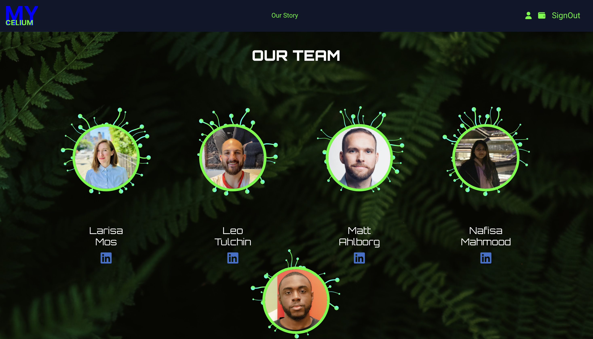

# Mycelium: Your Personal NFT Minting Platform

## Overview

Mycelium is your personal NFT minting platform that empowers creators to mint their own unique NFTs directly on the blockchain. With our intuitive interface and seamless integration with popular cryptocurrency wallets, you can easily bring your digital creations to life and engage with a global community of digital art enthusiasts. Our mobile-first design ensures a smooth user experience across all devices, allowing you to mint and manage your NFTs on the go.

It was the not so early days of the NFT revolution, a time when digital assets were fully claiming their rightful place in the world. A small team of innovators, fascinated by the hidden networks beneath our feet, found their muse in the enthralling mycelial networks that span beneath the forest floors. Our marketplace, akin to the mycelial networks, aims to connect digital creators and enthusiasts across the globe, fostering a vibrant ecosystem for trade and exchange of unique, digital assets. We looked to the mycelium not only for its symbolic representation of interconnection but also for its decentralization, its resilience, and its organic evolution. Thus, our platform emerged, intertwining nature's wisdom with blockchain technology, to create a marketplace that is as vibrant and dynamic as the mycelium that inspired it.
Explore the fascinating world of NFTs, showcase your creativity, and join the growing community of digital creators on Mycelium.

Visit our site at [here](https://myceliumnft.netlify.app). 

Check out our API and server [here](https://github.com/lst68868/mycelium_api).


## Features

- **Crypto Wallet Integration**: Link your cryptocurrency wallet to Mycelium and start minting NFTs in no time. We support a variety of popular wallets for maximum flexibility.

- **NFT Minting**: Create and mint your own unique NFTs directly on the blockchain. Our intuitive interface makes the process easy, even for beginners.

- **3D Animations**: Enjoy a visually stunning experience with our 3D animations, which add depth and dynamism to your NFT creation process.

- **User Authentication**: We prioritize your security. Our robust user authentication system ensures that only you can access your account and mint NFTs.

- **Mobile-First Interface**: Designed with a mobile-first approach, Mycelium ensures a seamless user experience across all devices. Whether you're on a smartphone, tablet, or desktop, you can mint your NFTs with ease.




## Getting Started

1. **Clone the repository**

```bash
git clone https://github.com/yourusername/mycelium.git
```

2. **Install dependencies**

Navigate to the project directory and install the necessary dependencies:

```bash
cd mycelium
npm install
```

3. **Start the application**

```bash
npm start
```

The application will start running on `http://localhost:3000`

## Technologies Used
- Frontend: React, React Router
- Backend: Python, Django, Alchemy, PSQL, MetaMask, Solidity(smart contracts), RemixIDE
- Deployment: Heroku, Netlify

## Future Enhancements

We have exciting plans for future enhancements to make Mycelium an even more robust and feature-rich NFT minting platform. Some of the planned enhancements include:

- **Search Feature**: Implementing a search feature that allows users to easily find specific NFTs based on keywords, artist names, or other relevant criteria.

- **NFT Marketplace**: Enabling the ability to buy and sell NFTs directly on Mycelium, creating a thriving marketplace for digital creators and collectors.

- **Categorization of NFTs**: Introducing a categorization system for NFTs, allowing users to browse and discover NFTs by different categories or themes.

- **User NFT Collection**: Enhancing user profiles to include a dedicated section for showcasing and managing collected NFTs, providing a personalized and immersive experience for users.

We are committed to continually improving Mycelium and providing a seamless and enjoyable experience for our users. Stay tuned for these exciting future enhancements!


## Contributing

We welcome contributions from the community. If you wish to contribute, please feel free to make a pull request.

## Support

If you encounter any issues while using Mycelium or have any feature requests, please file an issue on the [GitHub issues page](https://github.com/lst68868/mycelium/issues).

## License

Mycelium is licensed under the [MIT License](LICENSE).

## Acknowledgements

We would like to thank the open-source community for their continuous support and inspiration. We're excited to be a part of the journey to make NFT minting accessible to everyone.

## Contact

For any queries, feel free to reach out to us:

- Larisa Mos: [LinkedIn](https://www.linkedin.com/in/larisa-mos/)
- Leo Tulchin: [LinkedIn](https://www.linkedin.com/in/leotulchin/)
- Matt Ahlborg: [LinkedIn](https://www.linkedin.com/in/mattahlborg/)
- Nafisa Mahmood: [LinkedIn](https://www.linkedin.com/in/nafisa-mahmood/)
- JaJuan Godley: [LinkedIn](https://www.linkedin.com/in/jajuan-godley-35a154275/)
